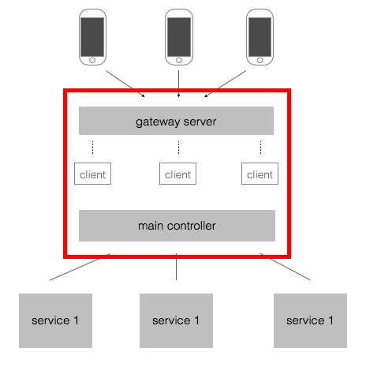

开发日记（一）
-----------
这原本只是tcpx的一个示例程序，但后来发现，仅仅想用tcpx来实现网游框架并不现实。因为考虑到不可能一个节点维持所有的连接，肯定要用到集群，那初步设想就是做一个网关，然后将所有服务挂在这个网关上。这个网关服务，可以基于我的tcpx来实现，其余服务尽管可以用tcpx，但场景已经变了，具体要如何扩展我的tcpx来适应新的场景会是一个难点。

#### 2015年11月23日 下午12:05
在画框架图的过程中，发现之前可能想错了。现在我给出的框架图和[云风的框架图](http://blog.codingnow.com/2011/11/dev_note_1.html)，可以说是别无二致。但我误以为我原本设计的tcpx中是没有gateway这一说法的，从而导致我打算基于tcpx专门做一个gateway服务，但实际上我早已把gateway的功能涵盖到tcpx中，下图红框圈出部分就是tcpx需要完成的事情。

其实也就是我最初的设计思想，用一个routelist来管理所有挂载的服务，根据client传来的请求转发至相应服务。那还有哪些东西需要改进的呢？目前我能想到的有这样两方面：
- tcpx多机部署后的通讯问题：计划重构client，为每一个client增加一个全局的id；重构message模块，使其能根据client的id进行消息传递。
- 各服务间的数据交换问题：增加对redis的支持。

开工ing

__2015年11月23日 下午11:57__
今天就忙着想思路了，加上本科同学聚会..哎～
