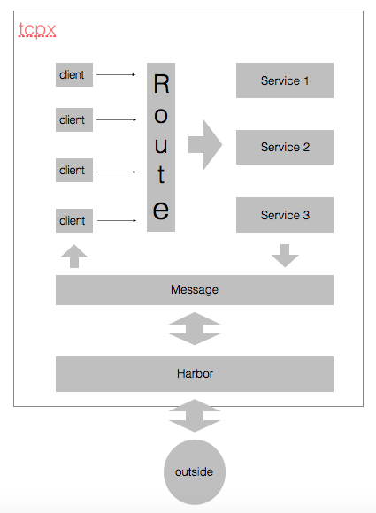

开发日记（一）集群通讯初步设计
-------------------------
开发日记系列主要以流水账的方式记载，大标题为每日开发进程，加粗为一天中的重要节点，最后的__总结__会讲这一阶段的开发成果做个综述。

tcpx_example原本只是tcpx的一个示例程序，但后来发现，仅仅想用tcpx来实现网游框架并不现实。因为考虑到不可能一个节点维持所有的连接，肯定要用到集群，那初步设想就是做一个网关，然后将所有服务挂在这个网关上。这个网关服务，可以基于我的tcpx来实现，其余服务尽管可以用tcpx，但场景已经变了，具体要如何扩展我的tcpx来适应新的场景会是一个难点。

#### 2015年11月23日 下午12:05
在画框架图的过程中，发现之前可能想错了。现在我给出的框架图和[云风的框架图](http://blog.codingnow.com/2011/11/dev_note_1.html)，可以说是别无二致。但我误以为我原本设计的tcpx中是没有gateway这一说法的，从而导致我打算基于tcpx专门做一个gateway服务，但实际上我早已把gateway的功能涵盖到tcpx中，下图红框圈出部分就是tcpx需要完成的事情。

其实也就是我最初的设计思想，用一个routelist来管理所有挂载的服务，根据client传来的请求转发至相应服务。那还有哪些东西需要改进的呢？目前我能想到的有这样两方面：
- tcpx多机部署后的通讯问题：计划重构client，为每一个client增加一个全局的id；重构message模块，使其能根据client的id进行消息传递。
- 各服务间的数据交换问题：增加对redis的支持。

__2015年11月23日 下午11:57__

今天就忙着想思路了，加上本科同学聚会..哎～

#### 2015年11月24日 下午12:04
message模块重构细节：
- 对于每一个tcpx节点有一个唯一的mid号，
- 每一个client是mid的子序号，类似于0.1、0.2、1.1、1.2这样子（参考actor模型）。

需要这样设计的原因是当多机部署时，每个节点维护各自的client，当需要广播数据时通讯就会成为问题，目前了解下来用actor模型是比较好的解决方案。

这样设计后，势必要考虑另一个问题，就是两个tcpx节点如何通讯的问题（节点1如何告知节点2：将消息发送给2.1client），这里我考虑用一个消息队列服务，来统一管理所有tcpx节点。

__问题__：这个设计没有将各服务间的通讯问题解决，主要是因为在我初步设想的功能里各服务间不存在请求－相应式的数据交互，只需共享数据库就可以解决数据交换问题。

__另一种做法__：参考[Skynet 集群及 RPC](http://blog.codingnow.com/2012/08/skynet_harbor_rpc.html)，云风大大把gateway服务当作是tcpx下挂载的服务之一，更神奇的是他将每一个client也当作挂载的服务之一，然后同样设计了actor模型，如此一来便一并解决了各服务间的通讯问题。

__抉择__：估且按照我设想的场景来做，message仅处理对client消息的回发。（隐患：如何解决非请求-相应式的消息发送。可能得在tcpx里开一个接受message的服务，那会不会要考虑逻辑顺序的问题？）

_纠结_：当把client映射为一个id后，也就使client对服务透明了，将client作为参数传递给具体服务是不妥当的，一定要统一为message传递，那样的话message就不仅仅是负责回发消息给client了，而且route模块也要重构，设想将route模块整合进message模块，仿照云风的actor模式。

_偷懒_：实在不高兴改动那么多，最终还是采用初版方案，写了个MessageManager管理回发给client的message。

__2015年11月24日 下午9:16__：真正自己用了才发现原来有那么多毛病。为了实现集群通讯，不得不在tcpx内部再开一个服务，这个服务我原本想可以直接用tcpx在实例化一个server就ok了，结果却发现还是有很多不灵活的地方，折腾半天，总算是可以用tcpx最简化得实现一个server了。

__2015年11月25日 上午12:29__：基本实现了message模块，在未增加redis的支持下，模拟了跨机通讯，结果满意。但其中仍有两个问题：

- 协议不规范，导致误解码
- 今后如有服务间的通讯问题，还是得大改，暂且先这样将就用用，实现预想功能先。

#### 总结
这里给出目前tcpx内部架构图：

