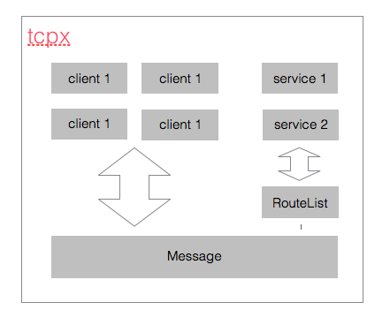
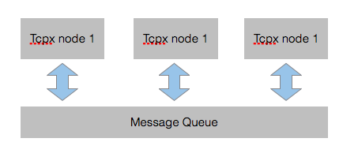
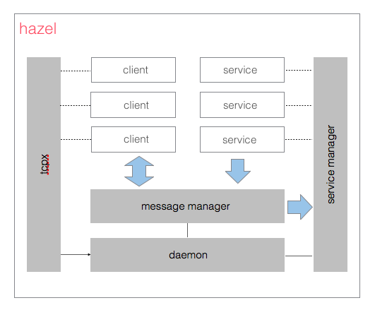

开发日记（二）~~集群通讯进阶设计~~大改版之daemon设计
-------------------------
在上一篇结尾处，我提到有两方面不足：

1. 协议不规范，导致误解码
2. 今后如有服务间的通讯问题，还是得大改，暂且先这样将就用用，实现预想功能先。

关于第一点，很早就应该设计好了，单因为懒啊，加上为了调试方便，就迟迟没改，那么现在..也不会改啦（反正已经预留了接口）。

关于第二点，思考了一晚上后，觉得还是得改，改好后再统一协议。

#### 2015年11月25日 下午10:23
这里先给出__预期效果图__：

__预期效果__：以上仅仅是一个草稿，像是accept connection的server模块，也就是gateway的功能并没有体现在其中，在整个架构里，一旦获取到了与connection对应的client实例，接下来就喝server无关了。message模块可以和tcpx解耦，route模块最好可以合并进一个service模块，这样后期给service加功能也方便，比如事件响应。

__问题__：message调度msg时，需要用到service列表和client列表，而这两个都来自tcpx.server，也就是我上面所说的没什么用的server！解耦十分困难！这里就可以明显看到server在不知不觉中承担了越来越重的任务，一定要对它好好下刀子了！！

__解决方案__：重构内部逻辑代码（真正的大改！）

#### 2015年11月25日 下午11:30
大功告成，之前的版本中底层tcp服务和上层的gateway，乃至tcpx核心功能message（这点要明确，之前就是没有明确message的重要地位，而一直想将它解耦，结果弄巧成拙）关联太大。

产生这个问题的__主要原因__是：我默认以gateway服务为核心，将其扩展为整个tcpx结构的核心。

__解决方案__：现在我以一个全新的模块daemon为核心，将gateway的功能抽离出来，作为daemon的一个组件（组合方式参考了docker源码）然后最最激动人心的是tcpx正式改名为__hazel__！！！！原本的tcpx仅作为一个底层服务，类似于docker里的apiserver。

#### 2015年11月26日 下午3:57
今天电脑显示器坏了，耽搁了大半天。现在主要考虑两方面优化：

- 模块间的可见性优化
- 协议优化

然后还要把事件功能加上，使client异常断开连接后，可以通知service清楚与之相关的资源。（如推出聊天室）

这一功能考虑下来有两种实现方式：

1. 增加一系列事件接口，具体service可以自由选择是否实现这些接口，当需要调用时判断每一个注册的service是否实现了响应接口，实现了则调用。
2. 在service中增加一个事件注册的函数，service内增加一个eventmap来管理所有event，当需要时则调用。

第一种方式如若实现，代码会很好看，但也增加了具体service和hazel内部service模块间的耦合，尽管已经都抽象至接口了。

第二种显得太简单了，但不失为一种高效的方法。鬼知道接口检查的效率是否高呢。

为了用上点golang的高级技巧，更面向对象，我选择第一种方式哈。而且用了第一种方式可以更好地透过hazel来管理挂载的service服务。

__2015年11月26日 下午9:04__：以上全部优化完毕后，就要正式进入集群通讯的重构上了，首先先考虑数据共享的问题，毕竟没有那么多场合需要集群通讯的。最简单的就是增加redis的支持，但我现在考虑的是如果不启用redis，怎么共享数据。很多框架都支持redis，同时不用redis也可以完成功能，怎么办到的呢？

我目前之所以陷入这样的困境，是因为我将所有的消息传递统一了，用一个message模块来管理。以前我可以扩展client的功能，使之集成sharepreference的功能，并让service获取得到来使用，但现在service只能见到代表client的clientid，而这个就不太好处理了。

首先要明确一点，如果不启用redis，则默认为单机运行，所有数据自然可以共享。问题就在把这个共享数据绑定到哪里？有以下几个可选项：

- 哪来好几个选项...client这条路被堵死了，只好存在local service里了啊

那问题就是别的service如何获取到这个共享信息的问题了，根据目前框架..在不支持redis的情况下，只能通过message来获取了，且这个是一个阻塞式－请求响应的message，得考虑session机制。go里面要实现session恐怕得借助channel，因为我并不知道如何保存一个goroutine，只好考虑是不是在goroutine里和外面用一个channel连接。

哈，有意思的事情来了，let's 玩！

#### 2015年11月27日 上午12:18
__It finished !__

小插曲：这个session机制中，要考虑到channel读写超时的问题，一不小心就有可能多一个孤儿线程。so interesting！

给出目前架构图：

啊～～～搞了大半天，docker都还没玩起来！！
