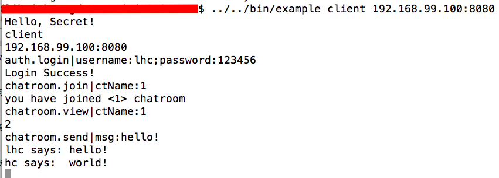

开发日记（二）集群通讯进阶设计与docker部署
-------------------------
经过上一版本的大翻新后，原本设计好的集群通讯，尽管能用，但并不理想。

原先设计的集群通讯图如下所示：

假设有n个节点则要维护n(n-1)/2条连接，这种设计会耗费相当多的网络资源。而且这只是理想情况，实际在应用中的连接数可能会翻一番，也就是n(n-1)条，因为理想设计对于开发维护的难度较大，所以通常会使用单通道的tcp连接，如此一来，上图中每一条线就代表两条连接了。

一个比较容易想到的优化模型，就是消息队列的方式了，但这究竟是否算是优化，其实还得打个疑问，至少对于初学golang的我来说，亲自实现一个消息队列，会是件很有意思的事哈。

我要实现的消息队列，肯定不能太复杂，能完成基本功能就好。

#### 2015年11月27日 下午11:02
今天有事耽搁了，只修复了些bug，以及用redis重写了chatroom。我其实觉得hazel本身支不支持redis都无所谓，反正我又没有集成orm等便利数据库功能，要用的话直接用就是了，包括postgresql也是一样。

bug包括以下几点：

- 修复了session机制中存在的bug，由于message都是通过指针传递，导致在这期间误修改了message实际内容。
- 修复了事件响应中若不通过message manager，而直接调用自身函数而导致的与session相关的错误，这个事件中正好涉及到session。

对于redis的使用，我采用的是[garyburd/redigo/redis]("github.com/garyburd/redigo/redis")，不是很便捷，从redis中获取到的数据还得转换类型，包括用了连接池，但却没有相关直接通过连接吃调用的函数。

此外对于redis的设计并不是很懂，看以前做chrome插件时阿翔写的代码，照搬着用吧，功能是勉强实现，Orz..调试了半天额!

今天基本就是这样了，明天早起可以集群通讯和docker部署两步走了，毕竟多了个redis服务了，由于时间关系..最好先把docker再玩玩好，集群通讯这块的设计，逼近之前已经搞过，完善什么的以后再说也行哈！

#### 2015年11月28日 上午11:27
刚发现！DaoCloud上没有postgresql服务，只有mysql的！好吧，原本还有选择余地的，现在不用考虑了，只能在Daocloud上挂flask了。 hazel就在本地玩玩吧，一个基本可用的docker应用栈如下图所示：

稍微理想一点的就是这样了，无奈现在集群通讯还没完善好，放出个臆想图，以后再弄咯。

__2015年11月28日 下午4:33__：啊～～docker pull images的速度太慢啦！！ 难道逼我在我机子上装dao？好吧！装！！

#### 2015年11月28日 下午11:47
玩docker玩得飞起～，装好DaoCloud Toolbox后，简直爽快.....好吧～不拍马屁，也就爽了两下- -，因为只需pull两个images而已，真的很快，非常快！

想想最初接触docker时，每个动作都是蹑手蹑脚的额，什么run一个image后，就去ps一下，怕污染我的mac，每次还要把container删了，再检查检查有没有什么useless的images，总之就是畏首畏尾的。

现在，为了进步！大胆得用吧！！然后感觉还不错诶，我一度忘记在宿主机go install我的代码哈，因为我都写进dockerfile里啦，嘻嘻。

这个晚上学者自己写dockerfile的过程中，看了好多别人写的，尤其是官方维护的那几个，不得不感叹人家做得真是优美。感触最深的要数postgres的了，之前看docker的书时，书里提到容器化的思维，当时并不理解，书里提到的几个问题，包括“如果需要进入容器调试，该怎么办？”，“定时任务该如何设置？”，“监控怎么办？”等等，我自己因为没有接触过这些操作，要我现在来说，我的回答依然是不知道，但对于容器化思维我稍微有了点认识。

__学习postgres的容器思维__ ：
刚pull postgres时，我想～不对呀，要说是redis，那还好说，因为不需要建数据库，可以直接用，但是这个postgres怎么办啊，我是不是需要到容器里手动建表呢？我正这么边想着边`docker run -it postgres`，然后就傻了..是我忘记加`-it`了吗？怎么直接就运行了！都没有bash给我用，然后现在是知道了后面加上/bin/bash，就可以有控制台了，不过说来幸好我当时没试，不然就少了次学习的机会啦～

看了postgres的官方文档后，了解到了一点，就是原本需要ssh到服务器上执行的初始化任务，都通过run的参数，或增加volume来实现，也就是通过配置来实现了，这个容器就是用来提供postgres服务的。让我吃惊是用户名和密码都没设置成了环境变量，做到这地步，只能说是容器化的思维啊。

__构建自己的image__：然后折腾了一会postgres的数据库备份还原，便进入我自己项目的images构建了。说来，我的第一个dockerfile就是这个blog的，这个还算简单，刷刷刷就写好了...然后就报了一堆错，不过倒是和dockerfile的编写无关，主要是我没考虑到一些go的依赖包什么的。

写着写着，发现dockerfile要写得好，还是需要一点设计的哈，怎样设计才算好，我也不清楚，我就按想的来吧，大概要做到这几点：

- 要便于我的开发和调试，不能把hazel用go get获取，那样的话就没法跟踪我正开发的hazel了。
- 配置文件不要写死，这就是上面看postgres后的体会。

如何做到呢？__对于第一点__，我直接把hazel单独做了个image，以后如果代码有更新就重新构建下images就好了，说来这构建images的速度还是蛮快的，可能是东西比较小吧。__对于第二点__，之前我要运行我的hazel_example，会调用项目里被ignore的config文件，而这个文件按理也同样是不能放到容器里的，所以尽管我cp了项目里的所有文件，但这些配置文件不能动。看来只好用volume，固定一个config文件的目录，然后写个脚本，如果存在这个目录就运行server，不存在就不运行，就像postgres那样。但是！为了偷懒，和便于我调试....嘻嘻我暂且先用着写好的配置文件，也不设置cmd，嘻嘻，直接-it走起。

__运行我们的容器吧__：因为hazel_example要用到postgres和redis两个容器，所以先启动两个数据库，最后启动hazel_example，link上两个数据库，结果是一次成功哈，好开心。

__测试一下__：在本地宿主机上，create一个client连接到hazel暴露出来的端口。一切正常，测试成功，庆祝一下哈～

这个项目做到这，就暂时告一段落，记录下遗留问题：

- 集群通讯的进阶设计
- docker编排（这个在另一个项目里会用到吧）

#### 总结
给出效果图：

为什么我的总结总是几张图呢？因为我懒啦～
