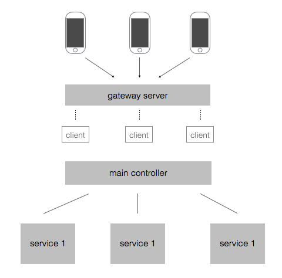

这是啥
-----
这是一个网游，什么网游？还不清楚。what？！因为只想先用golang实现一个框架，源代码：[tcpx](github.com/sctlee/tcpx),[tcpx_example](github.com/sctlee/tcpx_example)

## tcpx
tcpx是对tcp的一层封装，用于实现高并发的tcp server。

## tcpx_example
这是网游框架的源码，初步框架图如下图所示：

