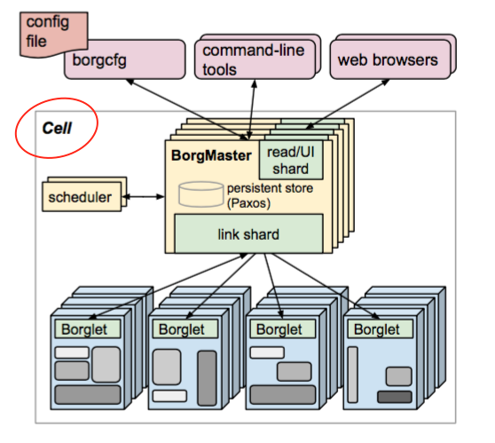

Borg阅读（一）
-----------
论文地址：http://static.googleusercontent.com/media/research.google.com/zh-CN//pubs/archive/43438.pdf

参考：[Docker背后的容器管理——从Borg到Kubernetes(一)](http://mp.weixin.qq.com/s?__biz=MjM5MDE0Mjc4MA==&mid=208497152&idx=1&sn=3d57ee9f197cf87be506749f05206d93)

## 怎么读
这里我并不想直接把我阅读后的总结写上来，我希望把阅读过程也一并记录下来，会以一个个QA来记录如何看懂文中不懂之处。
ok，那么现在一只Lv1的小白要出发了～～～

## 匆匆阅过全文
这篇文章写得甚是有趣，它首先从使用者的角度(the user perspective)来看borg，详解了job、task、cell等概念。在读者对
borg有一个使用上的认识后，便开始介绍borg的architecture，让我们看到上述的borg在使用中的特性是如何在borg中构建实现的。
以上两部分应该说已经很好得介绍完borg了，但其只占了整篇论文的1/3。因为这种系统borg并不是第一个，这篇论文的意义更多的是
borg作为支持google整个集群的管理系统，在可用性、资源回收、利用率等问题的优化上有哪些独到的见解，这便是论文后2/3部分主
要详解的内容。

当我看到最后一章居然是关于borg对Kubernetes设计上的启发时，顿时两眼放光哈，下定决心要好好拜读一下全文了，但愿能看懂个十
之八九把。

## The user perspective

#### Q1. cell、cluster、building、site之间的关系到底是怎么样的啊。。。？
尴尬，才第一段干货就被这细思极恐（大概是这么用的）的定义给弄晕了。
> The machines in a cell belong to a single cluster...

> A cluster lives inside a single datacenter building...

我一开始以为这两句都表明了一个一对一的关系，现在细细想来，应该是只表明了一个从属关系吧，英语渣渣啊，纠结半天0.0。

看到第三章Borg架构时，才发现Borg架构仅针对cell这一层次，然后再仔细看了下Borg的架构图....如下图所示～（泪崩ing）

#### Q2. job、task、alloc..之间也有点混乱啊！
> Allocs can be used to set resources aside for future tasks, to retain resources between stopping a
task and start- ing it again, and to gather tasks from different jobs onto the same machine

看到这里的‘gather tasks from different jobs onto the same machine’，我想就是infoQ里说的‘交叉’的来源吧。

> 另外，Kubernetes实际上没有Job这个说法，而是直接以Pod和Task来抽象用户的任务，然后使用相同的Label来标记同质的Pod副本。
这很大程度是因为在Borg中Job Task Alloc的做法里，会出现“交叉”的情况，比如属于不同Job的Task可能会因为“超亲密”关系被划
分到同一个Alloc中，尽管此时Job只是个逻辑概念，这还是会给系统的管理带来很多不方便。

论文到这仅仅是在论述，感觉还不能得出infoQ里所说的与Kubernetes中Pod等概念的对应关系。大体先按infiQ总结的来理解吧。

#### Q3. 服务发现到底是什么？
看完[Docker背后的容器管理——从Borg到Kubernetes(一)](http://mp.weixin.qq.com/s?__biz=MjM5MDE0Mjc4MA==&mid=208497152&idx=1&sn=3d57ee9f197cf87be506749f05206d93)
后，最大的疑惑就是服务发现在分布式系统中究竟承担着什么样的指责呢？在任务调度中，该服务是否有参与呢？是怎么参与的呢？尽管
borg用的Chubby组件，但鉴于Kubernetes用的是etcd，便着重了解了下etcd。

调研的结果让我大吃一惊啊，因为这个东西可以解决之前我在hazel开发中遇到的问题啊，当时的问题是：我有两个hazel服务，如何相
互通信的问题，hazel A和B得互相知道各自的ip地址，当时看云风的博客也有提到这个问题，他当时是额外建了个简单的键值存储仓库
的服务，A和B接受一条转发消息时，便去该键值仓库处查找目标实际地址，这样便可以建立集群间的通讯了。后来我嫌这麻烦，想想也不
需要考虑服务动态变化的情况，便用一个静态文件敷衍过去了。

不过仔细看看etcd，解决上面这个问题对它来说可谓是大材小用了哈，人家可是很高大上，还有什么Raft强一致性算法什么的，完全看
不懂哈。本着一究到底的精神，让我来攻克这个算法吧！！

在看Raft算法前，我得把服务发现，和任务调度在集群管理中的职责区分清楚：
> It’s not enough to create and place tasks: a service’s clients and other systems need to be able
to find them, even after they are relocated to a new machine

上面这句话，一下子把之前困扰我的问题理清了（我是得多弱哈[哭笑不得]）。我之前没理清的地方在于所谓的服务间互现感知，那这里
所说的服务是指什么？是指构成Borg的各个相关模块or多个Borg服务？还是指运行在Borg上的应用or服务？当我理解成第一种，便有
了服务发现是否与任务调度是紧密关联的疑问了...现在知道了，其实是第二种理解。我想了下，我之所以会有第一种错误理解，因为我
之前在做hazel时，也有服务发现的问题，我便把hazel的运行环境套到了Borg上，实际上，hazel也不过是Borg上的一个应用罢了。

啊偶，当看到第三章时，Borg中的BorgMaster有5个实例备份，这也会需要用到Chubby组件，一方面用于选举出leader，另一方面保
证一致性（准确说是为了保证一致性，才有必要选举出一个leader来作为协调者）。这么看来，一致性算法在分布式集群中的用处还真
是无所不在啊～

然后我发现... 关于这Raft等一致性算法，我还是另开一个分类再写吧（orz好多概念不懂额），用python和go能自己实现一下最好。

__总结（上面写得比较混乱，这里稍微梳理一下）：__ Chubby中用的是Paxos算法，而etcd中用的是Raft算法，这里我仅讨论一致性
算法在分布式集群中的作用，不涉及算法好坏以及Chubby和etcd具体做的事情。在一个分布式集群中，当出现以下两种情况时，会需要
用到一致性算法：

1. 一个服务有多个实例时，如Borg中的BorgMaster，它就有5个实例。此时我们需要保证的是，5个实例的状态要一致，那么很显然只
能有一个实例为协调者，来统一各个实例的状态。这时在一致性算法中，就有了第一个阶段——选举leader，当leader选举出来后，由
leader带领一系列操作，如日志复制等来保证一致性。
2. 当多个状态可变的服务间需保持互相通信的状态时，这里我主要根据我之前hazel中的问题来考虑。在一个妇分布式集群中，一个服
务可能会因重启、重分配而导致ip地址变化，而之前与他通讯的服务需要及时获取最新的IP地址，保持连接。这样就需要一个能及时更新
各个服务状态的存储仓库，所有的服务由这里来获取服务的IP地址。这其中具体的过程我还不清楚，日后再写。

## Borg architecture
#### Q1. 'avoid head-of-line blocking behind a large job'这句话什么意思？？
翻看infoQ，大致意思就是避免“线头阻塞”的发生（某个任务一直不能完成调度导致它后面的所有任务都必须进行等待）。
在什么情况下会发生，任务一直不能完成调度呢？？

#### Q2. 在任务调度打分环节，有几个标准，英语看不明白－ －？
> spreading tasks across power and failure domains

infoQ的翻译是：使任务精良分布在不同的高可用域中。但...我怎么看都没看出这句话是这个意思啊，那个failure怎么被吞掉啦？！
我感觉是说使任务分散到考可用和失败域之间，就是不要把任务都集中在高可用域上啊！

然后论文之后也讲述了Borg之前使用的E-PVM模型，以及和E-PVM相对的另一个极端，意思也正如infoQ中所说：
> Borg采用的是“混部加抢占”的模式

这里我以为混部指的是第三条标准，而抢占就是第四条标准，所以infoQ的之前的翻译应该是有问题的吧。

#### Q3. Borg采用由master主动轮询borglet的方式来检查机器的状态，这样做有什么好处呢？
> This gives Borgmaster control over the rate of communication, avoids the need for an explicit flow
 control mechanism, and prevents recovery storms

infoQ中只说明了一点，就是避免‘恢复风暴’（比如大量失败后恢复过来的机器会在同段一时间不停地向Borgmaster发送大量的恢复数
据和请求，如果没有合理的拥塞控制手段，者很可能会阻塞整个网络或者直接把master拖垮掉）。但前一点‘avoids the need for
an explicit flow control mechanism’ 是什么意思呢？ 避免一个明确留控制机制的需求？这里论文中给了一篇参考文献，可以
去看看，[Availability in the Sprite distributed file system. Operating Systems Review](http://dl.acm.org/citation.cfm?id=122131)
 是1991年在acm上的一篇综述..

## 小总结
看到这，可以发现的是这篇论文只是把Borg如何应对一个分布式集群中会遇到的问题的解决方案讲了下。鉴于自己对分布式集群知识的薄
弱，它说的我能看明白了，但我并不知道为什么要解决这样那样的问题（如：一开始我并不明白服务发现起了什么作用，为什么要服务发
现），也不知道除了Borg中说到的解决方案外还有什么其它方案，各自的优缺点是什么。所以在分布式集群上我还有许许多多要学的，等
有了更进一步的知识积累后，再在这里每一个问题上做扩展。
